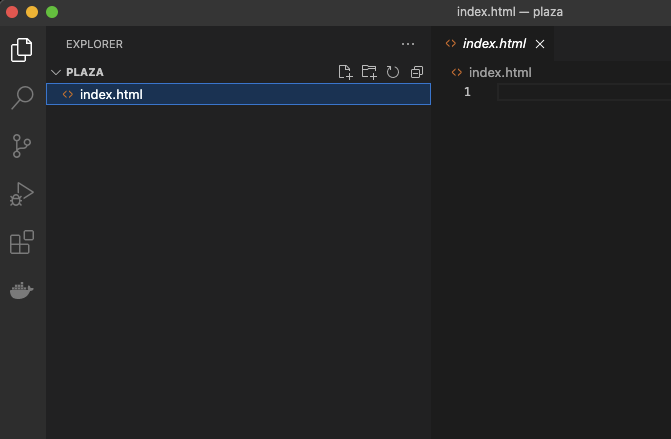
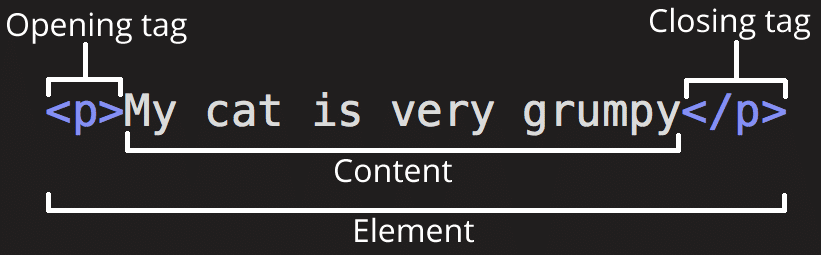
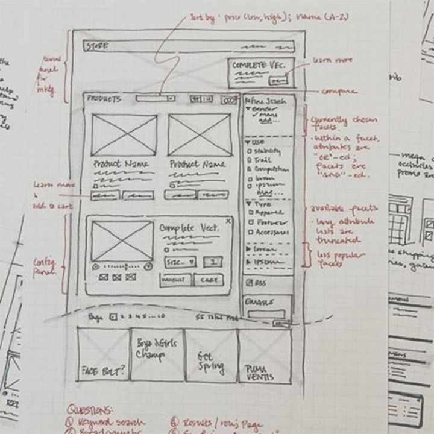

# Proyecto Plaza Virtual Parte 1: Introducción a HTML
{: .no_toc }

<details open markdown="block">
  <summary>
    Table of contents
  </summary>
  {: .text-delta }
1. TOC
{:toc}
</details>

---

# Introducción:

HTML, o HyperText Markup Language, es el "esqueleto" de la web. Si CSS 'viste' su HTML y JavaScript le da vida, el cuerpo de su aplicación web es su HTML. La sintaxis de HTML incluso refleja esa idea, ya que incluye etiquetas "head", "body" y "footer".

En esta lección, usaremos HTML para diseñar el 'esqueleto' de la interfaz de una aplicación que nos permita diseñar una plaza virtual. Tendrá un título y tres columnas: las columnas de la derecha e izquierda, donde están los diferentes elementos de la plaza (plantas, bancos, animales, etc), y un área central que será el terreno para la plaza. Al final de esta lección, podrás ver los elementos en las columnas, pero la interfaz se verá un poco extraña; no te preocupes, en la siguiente sección agregarás estilos CSS a la interfaz para que se vea mejor.

### Actividad:
{: .no_toc }

En tu computadora, crea una carpeta llamada 'plaza' y dentro de ella, un archivo llamado 'index.html'. Puedes hacer esto en Visual Studio Code.

* Crea una carpeta en el escritorio (o donde quieras guardar el proyecto) y llamala 'Plaza'.
* Abri Visual Studio Code.
* Navega a 'File' (archivo) y hace click en abrir carpeta. Busca y selecciona la carpeta recién creada.
* Hacé click en el clic en el botón pequeño 'archivo' en el panel del Explorador y crea el nuevo archivo:



> Los archivos index.html indican a un navegador que es el archivo predeterminado en una carpeta; las URL como `https://anysite.com/test` se pueden construir usando una estructura de carpetas que incluya una carpeta llamada `test` con `index.html` dentro; `Index.html` no tiene que aparecer en una URL.

---

# Las etiquetas DocType y html

La primera línea de un archivo HTML es su doctype. Es un poco sorprendente que necesite tener esta línea en la parte superior del archivo, pero le dice a los navegadores más antiguos que el navegador necesita representar la página en un modo estándar, siguiendo la especificación html actual.

> Consejo: en VS Code, puedes colocar el cursor sobre una etiqueta y obtener información sobre su uso en las guías de referencia de MDN.

La segunda línea debe ser la etiqueta de apertura de la etiqueta `<html>`, seguida ahora por su etiqueta de cierre. Estas etiquetas son los elementos raíz de su interfaz.



### Actividad:
{: .no_toc }

Agrega estas líneas en la parte superior de tu archivo `index.html`:


```html
<!DOCTYPE html>
<html></html>
```

✅ Hay algunos modos diferentes que se pueden determinar configurando DocType con una cadena de consulta: [Modo Quirks y Modo estándar](https://developer.mozilla.org/docs/Web/HTML/Quirks_Mode_and_Standards_Mode){:target="_blank"}. Estos modos solían admitir navegadores realmente antiguos que no se utilizan normalmente en la actualidad (Netscape Navigator 4 e Internet Explorer 5). Puedes ceñirte a la declaración de tipo de documento estándar.

---

# El 'encabezado' del documento

El área 'encabezado' del documento HTML incluye información crucial sobre su página web, también conocida como [metadatos](https://developer.mozilla.org/docs/Web/HTML/Element/meta){:target="_blank"}. En nuestro caso, le decimos al servidor web al que se enviará esta página para que sea renderizada cuatro cosas:

- el título de la página
- metadatos de la página que incluyen:
    - el 'conjunto de caracteres', que indica qué codificación de caracteres se utiliza en la página
    - información del navegador, incluido `x-ua-compatible`, que indica que el navegador IE = edge es compatible
    - información sobre cómo debería comportarse la ventana gráfica cuando se carga. Configurar la ventana gráfica para que tenga una escala inicial de 1 controla el nivel de zoom cuando la página se carga por primera vez.

### Actividad:
{: .no_toc }

Agrega un bloque de 'encabezado' a tu documento entre las etiquetas de apertura y cierre `<html>`.

```html
<head>
	<title>Mi plaza virtual</title>
</head>
```
---

# El `cuerpo` del documento

## Etiquetas HTML

En HTML, agregamos etiquetas al archivo .html para crear elementos de una página web. Cada etiqueta generalmente tiene una etiqueta de apertura y cierre, como esta: `<p>hola</p>` para indicar un párrafo. Cree su interfaz `<body>` agregando un conjunto de etiquetas dentro del par de etiquetas `<html>`; tu marcado ahora se ve así:

### Actividad:
{: .no_toc }

```html
<!DOCTYPE html>
<html>
	<head>
		<title>Bienvenida a mi plaza virtual</title>
		<meta charset="utf-8" />
		<meta http-equiv="X-UA-Compatible" content="IE=edge" />
		<meta name="viewport" content="width=device-width, initial-scale=1" />
	</head>
	<body></body>
</html>
```

Ahora puedes comenzar a construir tu página. Normalmente, usas etiquetas `<div>` para crear los elementos separados en una página. Crearemos una serie de elementos `<div>` que contendrán imágenes.

# Imágenes

Una etiqueta html que no necesita una etiqueta de cierre es la etiqueta ``, porque tiene un elemento `src` que contiene toda la información que la página necesita para representar el elemento.

Crea una carpeta en tu aplicación llamada `images` y en ella, agrega todas las imágenes de la [carpeta del código fuente](
https://drive.google.com/drive/folders/1B4jyu2C2q2CSOnwIt8yFI-rE2U9sdmXx?usp=sharing){:target="_blank"}; (hay 18 imágenes).


### Actividad:
{: .no_toc }

Agrega estas imágenes de elementos en dos columnas entre las etiquetas `<body> </body>`:


```html
<div id="pagina">
    <div id="contenedor-izquierdo" class="contenedor">
        <div class="contenedor-componente">
            
        </div>
        <div class="contenedor-componente">
            
        </div>
        <div class="contenedor-componente">
            
        </div>
        <div class="contenedor-componente">
            
        </div>
        <div class="contenedor-componente">
            
        </div>
        <div class="contenedor-componente">
            
        </div>
        <div class="contenedor-componente">
            
        </div>
        <div class="contenedor-componente">
            
        </div>
        <div class="contenedor-componente">
            
        </div>
    </div>
    <div id="contenedor-derecho" class="contenedor">
        <div class="contenedor-componente">
            
        </div>
        <div class="contenedor-componente">
            
        </div>
        <div class="contenedor-componente">
            
        </div>
        <div class="contenedor-componente">
            
        </div>
        <div class="contenedor-componente">
            
        </div>
        <div class="contenedor-componente">
            
        </div>
        <div class="contenedor-componente">
            
        </div>
        <div class="contenedor-componente">
            
        </div>
        <div class="contenedor-componente">
            
        </div>
    </div>
  </div>
```

> Nota: Spans vs. Divs. Los Divs se consideran elementos de 'bloque' y los Spans están 'en línea'. ¿Qué pasaría si transformaras estos divs en spans?

Con este código, los componentes ahora aparecen en la pantalla. Se ve bastante mal porque aún no están los "estilos", que se escriben en CSS , cosa que haremos en la próxima lección.

Cada imagen tiene una etiqueta alt que aparecerá incluso si no se puede mostrar una imagen. Este es un elemento importante a incluir para la accesibilidad. Por ahora, recuerda que es importante permitir que los usuarios con discapacidad visual puedan utilizar tu sitio web.

✅ ¿Notaste que cada imagen tiene la misma etiqueta alt (mismo valor)? ¿Es esta una buena práctica? ¿Por qué o por qué no? ¿Puedes mejorar este código?

---

# Marcado semántico

En general, es preferible usar 'semántica' significativa al escribir HTML. Qué significa eso? Significa que tenemos que utilizar las etiquetas HTML de la forma en que fueron diseñadas. Por ejemplo, el título principal en una pagina debería usar siempre una etiqueta `<h1>`.

Agrega la siguiente línea justo debajo de tu etiqueta de apertura `<body>`:

```html
<h1>Mi plaza</h1>
```

El uso de marcado semántico, como que los encabezados sean `<h1>` y las listas no ordenadas se representen como `<ul>`, ayuda a los lectores de pantalla a navegar por una página. En general, los botones deben escribirse como `<button>` y las listas deben ser `<li>`. Si bien es _posible_ usar elementos `<span>` de estilo especial con controladores de clic para simular botones, es mejor para los usuarios con capacidades diferentes usar tecnologías para determinar en qué parte de una página reside un botón e interactuar con él. Por esta razón, intente utilizar el marcado semántico tanto como sea posible.

# La plaza

La última parte de esta interfaz implica la creación del código que mas tarde será estilizado para crear una plaza.

### Actividad:
{: .no_toc }

Agrega este código encima de la última etiqueta `</div>`:

```html
<div id="placita">
    <div class="cielo"></div>
	<div class="suelo"></div>
</div>
```

✅ Aunque agregaste este código a la pantalla, no ves absolutamente nada renderizado. ¿Por qué?

---

🚀 Desafío: hay algunas etiquetas "antiguas" salvajes en HTML con las que todavía es divertido jugar, aunque no debes usar etiquetas obsoletas como [estas etiquetas](https://developer.mozilla.org/docs/Web/HTML/Element){:target="_blank"} en tu código. Aún así, ¿puedes usar la antigua etiqueta `<marquee>` para hacer que el título h1 se desplace horizontalmente? (si lo haces, no olvides quitarlo después)

# Tarea

## Practica tu HTML: crea una maqueta de blog
{: .no_toc }

### Instrucciones
{: .no_toc }

Siempre que vamos a empezar con el diseño de una pagina web o aplicación cualquiera, empezamos por diseñar un "Mockup". Esto es un bosquejo que puede estar hecho a mano o en herramientas digitales, que nos sirve para tener una idea de como va quedar y cuales son los distintos elementos que vamos a necesitar.

En esta tarea, se debe diseñar una pagina web con papel y lápiz o con cualquier herramienta digital, e identificar todos los elementos que conforman el diseño.

<div style="text-align: center">
    
</div>

### Rúbrica
{: .no_toc }

| Criterios | Ejemplar (5) | Adecuado (3) | Necesita mejorar (2) |
| -------- | -------------------------------------------------- --------------------------------- | -------------------------------------------------- ------------------------------ | -------------------------------------------------- ------------------------------- |
| | El diseño se representa visualmente con al menos 10 elementos de marcado mostrados | Un diseño se representa visualmente con alrededor de 5 elementos de marcado mostrados | El diseño se representa visualmente con un entre 1 y 3 elementos de marcado mostrados |