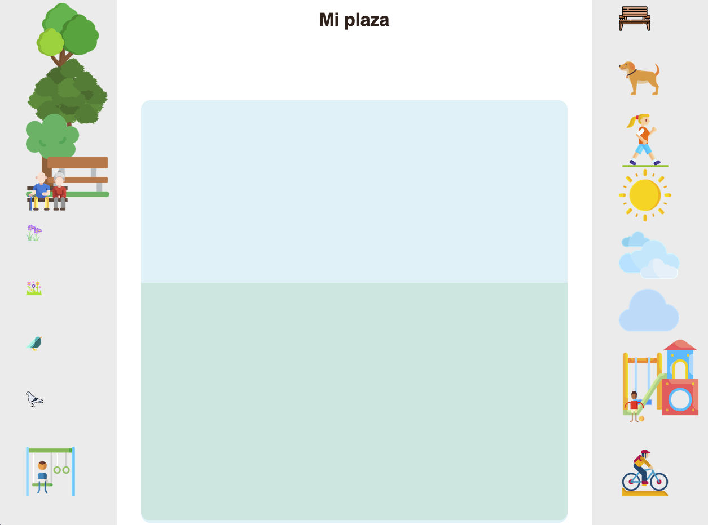

# Proyecto Plaza Virtual Parte 2: Introducción a CSS
{: .no_toc }

<details open markdown="block">
  <summary>
    Table of contents
  </summary>
  {: .text-delta }
1. TOC
{:toc}
</details>

---

# Introducción:

{: .concept }
Las hojas de estilos en cascada (CSS) son un mecanismo simple para agregarle estilo (colores, espaciado, tipos de letra, etc.) a un Documento Web (otra forma de referirnos a un archivo html).

CSS, o Cascading Style Sheets, resuelve un problema importante del desarrollo web: cómo hacer que tu sitio web se vea bien. 
La apariencia de una pagina web es muy importante, ya que en gran medida esto es lo que la hace útil y fácil de usar. CSS no se trata solo de hacer que tu aplicación se vea bien; también nos deja hacer animaciones y transformaciones que pueden permitir interacciones sofisticadas para tus aplicaciones.

Una organización conocida como *El grupo de trabajo CSS* ayuda a mantener las especificaciones CSS actuales; podés seguir su trabajo en el [sitio del World Wide Web Consortium](https://www.w3.org/Style/CSS/members){:target="_blank"}.

En esta lección, agregaremos estilos a nuestra página web y aprenderemos más sobre varios conceptos de CSS: la cascada, la herencia y el uso de selectores, posicionamiento y uso de CSS para estilizar una página.

## Requisito previo:

{: .important }
Deberías tener el archivo HTML del proyecto terminado y listo para darle estilo, fijate en el apartado "Introducción a HTML".

# La cascada

<div style="text-align: center">
    <iframe src="https://drive.google.com/file/d/1aKyFCA3CjgdlSZzCKnPsTFXv98IfjCny/preview" width="640" height="450" allow="autoplay"></iframe>
</div>

Las hojas de estilo en cascada incorporan la idea de que los estilos 'se mueven en cascada' de manera que la aplicación de un estilo está guiada por su prioridad. 
* Los estilos establecidos por el autor de un sitio web tienen prioridad sobre los establecidos por un navegador. 
* Los estilos configurados 'en línea' tienen prioridad sobre los configurados en una hoja de estilo externa.

### Actividad:
{: .no_toc }

Para entender mejor esto, empecemos por cambiar algún estilo en nuestra página web. En este caso, queremos que el título sea de color rojo, y no negro como está ahora.

Para hacer esto, ubiquemos el *encabezado* **Mi plaza** en nuestro archivo HTML. El encabezado debe estar en la primera linea dentro de `<body>`, y debe estar en una etiqueta `<h1>`:

```html
<h1>Mi plaza</h1>
```
Las etiquetas `<h1>` se muestran de color negro en el navegador. Para cambiar el color, podemos agregar un **Atributo** a la etiqueta. Los atributos nos permiten modificar la apariencia o el comportamiento de los elementos, y siempre se se agregan en **la etiqueta de apertura**. Para cambiar el estilo (en este caso, solo el color), usamos el atributo `style`.

Modificá la linea donde se encuentra la etiqueta `<h1>`, para que quede así:

```html
<h1 style="color: red">Mi plaza</h1>
```

{: .concept }
Todos los elementos HTML pueden tener atributos que proveen información adicional sobre los elementos.
Los atributos siempre van en la etiqueta de apertura y tienen un nombre y un valor, que se escriben así: **nombre="valor"**

✅ Guardá los cambios en el HTML y fijate que pasa en la página web. Acordate de actualizar la página para ver los cambios!

Si hiciste todo bien, deberías haber notado que el color del encabezado cambió, y ahora es rojo. Lo que hacemos con el atributo `style`, es decirle al navegador que aplique el estilo indicado entre comillas, que está escrito en CSS.

De esta manera podemos seguir estilizando la página web cambiando colores y otras propiedades. Sinembargo, esto implica agregar atributos a todos los elementos del HTML, y esto resulta muy poco práctico y difícil de comprender cuando nuestro documento se hace más grande.

Para resolver este problema, usamos "Hojas de estilo externas". Se tratan de archivos en los que podemos escribir todos los estilos que queremos aplicar.

---

### Actividad:
{: .no_toc }

En Visual Studio, crea un archivo nuevo llamado `style.css` en la carpeta `Plaza`.

El archivo `style.css`, será el lugar donde vamos a especificar todos los estilos de nuestra página.

Pero, ahora que tenemos un archivo externo donde vamos a escribir los estilos, como sabe el navegador que debe mirar ahí?

Tenemos que decirle al navegador que siempre mire el archivo que creamos para saber que estilos aplicar, esto se hace en el HTML, en la cabecera del archivo (en la sección `<head>`).

Ubicá la cabecera del HTML y agregá ahí esta línea:

```html
<link rel="stylesheet" href="./style.css" />
```

La **etiqueta** `<link />` define la relación entre el archivo HTML y otros archivos. Con el **atributo** `rel`, le decimos que el archivo que queremos vincular es una hoja de estilos, y el **atributo** `href` le dice al navegador donde encontrar el archivo.

{: .important }
En el atributo `href`, el nombre del archivo debe coincidir con el nombre que le dimos cuando lo creamos. Si mas adelante no ves cambios en los estilos, asegurate de que los nombres coincidan.

La cabecera del archivo HTML debería quedar así:

```html
<head>
  <title>Mi plaza virtual</title>
  <link rel="stylesheet" href="./style.css" />
</head>
```

Ahora que ya tenemos nuestra hoja de estilos externa creada y vinculada con el html, escribir nuestro primer estilo.

Agregá el siguiente código a tu archivo `style.css`:

```css
h1 {
  color: blue;
}
```

✅ ¿Qué color se muestra en tu aplicación web? ¿Por qué? (explicación mas abajo)

Si hiciste todo bien, no debería haber cambiado nada en la página.

Al escribir `h1{  }`, estamos diciendo que todos los estilos que escribamos entre las llaves `{}` se deben aplicar a todos los elementos `h1` en el HTML. En este caso, solo tenemos un elemento `h1`, al que en una actividad anterior le pusimos un estilo en línea para que sea rojo, directo en el HTML.

{: .concept }
`h1{  }` es un **SELECTOR** de etiquetas, porque selecciona todas las etiquetas `h1` del HTML para aplicarles los estilos correspondientes. Se puede usar para seleccionar cualquier etiqueta, por ejemplo: `div{  }`, o `h2{  }`

Ahora el navegador ve en nuestra hoja de estilos que estamos pidiendo que el color sea azul, así que el navegador tiene dos instrucciones contradictorias:

```css
/* EN EL CSS, DECIMOS QUE EL COLOR ES AZUL */
h1 {
  color: blue;
}
```

```html
<!-- EN EL HTML, DECIMOS QUE EL COLOR ES ROJO -->
<h1 style="color: red">Mi plaza</h1>
```

Como decide el navegador cual de los dos colores aplicar?

Lo hace siguiendo las reglas de la **cascada**, que dicen que siempre los estilos en linea tienen prioridad. Por eso el navegador sigue mostrando el color rojo, ignorando lo que escribimos en la hoja de estilos.

Si borramos el estilo en línea que aplicamos, el navegador tomará lo que encuentre en la hoja de estilos.

Probá dejando esta línea del HTML como estaba originalmente:

```html
<h1>Mi plaza</h1>
```

Si guardas todos los cambios y actualizas la página, deberías ver que el elemento h1 ahora es azul.

🚀 Desafío: ¿Que es la especificidad (specificity) en css? Averigua esto en internet y hace algunos experimentos.

---

# Herencia

Ahora que tenemos la hoja de estilos preparada y ya entendemos como y donde escribir CSS, empecemos a ajustar los estilos de nuestra página.

<div style="text-align: center">
    <iframe src="https://drive.google.com/file/d/1zcxK3dIXi9G2jkLVqZ8I23G5derf5Nq2/preview" width="640" height="450" allow="autoplay"></iframe>
</div>

### Actividad:
{: .no_toc }

En primer lugar, queremos cambiar la fuente del texto, esto es el tipo de letra de todo el texto en nuestra página. Para lograrlo, agregá el siguiente código el archivo CSS:

```css
body {
 font-family: helvetica, arial, sans-serif;
}
```
Guardá los cambios y actualizá la página web para ver que pasó.

Deberías haber notado un cambio en el tipo de letra.

Logramos cambiar el tipo de letra utilizando la **propiedad** `font-family`.

Pero, anteriormente habíamos dicho que para cambiar el estilo de un elemento HTML, usábamos un selector de etiquetas para seleccionar las etiquetas que queríamos cambiar. Para cambiar una etiqueta `h1`, utilizamos el selector `h1 {  }`.

Entonces, por qué ahora utilizamos un selector `body {  }` para cambiar un elemento `h1`?

En HTML, decimos que los elementos pueden tener padres e hijos (antepasados y descendientes). Todos los elementos dentro de una etiqueta `body` son hijos de esa etiqueta.

De esta manera, si miramos nuestro HTML y vemos una estructura así:

```html
<body>
  <h1>Mi plaza</h1>
</body>
```

decimos que el elemento `h1` es un hijo del elemento `body`.

Lo que hicimos con el selector `body {  }` es definir un tipo de letra para el elemento `body`, y todos los estilos que sean aplicados a este elemento serán **heredados** a sus hijos, en este caso, al elemento `h1`. Es por esta herencia que logramos que nuestro título cambie.

Hacemos esto de manera a que todo el texto que incluyamos en la página web tenga este tipo de letra, sin tener que aplicar estilos a todos los elementos de texto que queramos cambiar.

{: .concept }
En HTML, los elementos heredan los estilos de todos sus antepasados.

✅ Podés probar agregando otros elementos de texto para verificar cómo funciona la herencia, y te desafiamos a que hagas que otras propiedades sean heredadas (podes probar con la propiedad `color` que ya utilizamos).

---

# Selectores CSS

En CSS, los selectores son patrones o una sintaxis específica que nos permite *seleccionar* los elementos que queremos estilizar.

Nos permiten aplicar estilos elementos específicos. Hasta ahora, solo utilizamos los selectores de etiquetas.

<div style="text-align: center">
    <iframe src="https://drive.google.com/file/d/10a_C2XiNCtq0If6OiYjtHiHD0LxXq_7G/preview" width="640" height="450" allow="autoplay"></iframe>
</div>

## Selectores de Etiquetas

Hasta ahora, en el archivo `style.css` solo aplicamos estilos a dos elementos HTML: `<body>` y `<h1>`.

Los selectores de etiqueta o elementos nos permiten aplicar estilos a los elementos, buscando por sus etiquetas en el archivo HTML. Por ejemplo, cuando usamos el selector `h1 {  }`, estamos seleccionando **TODOS** los elementos de tipo `h1` en el HTML.

✅ Probá esto agregando otros elementos `h1` en el HTML. Todos deberían tener el mismo color. Luego podes agregar un elemento con otra etiqueta: `<h2>prueba<h2>`. Este no será afectado por los estilos en el selector `h1 {  }`.

### Actividad:
{: .no_toc }

Como tenemos un solo título en nuestra página, nos basta con usar ese selector para agregarle estilos. 

Necesitamos centrar el texto en la pantalla, y darle un color mas atractivo.

Por otro lado, podemos asignar el tipo de letra que queremos usar a la etiqueta `body`, para que todo el texto de la página sea igual.

Asegurate de que tu archivo CSS quede de la siguiente manera (puede que tengas que reemplazar cosas las pruebas que vinimos haciendo):

```css
body {
  font-family: helvetica, arial, sans-serif;
}

h1 {
  color: #3a241d;
  text-align: center;
}
```

✅ Cual es la propiedad que usamos para centrar el texto en la página?

---

Pareciera que con este tipo de selector podemos estilizar toda la página, pero el problema es que no podemos seleccionar un solo elemento específico, solo podemos seleccionar **todos** los `h1` o **todos** los `div`, y para continuar necesitamos aplicar estilos solo a un par de elementos de tipo `div`, pero no a los demás.

## Selectores de ID

Cuando en el HTML tenemos muchos elementos del mismo tipo (por ejemplo, muchos `div`) pero solo queremos modificar uno de ellos, podemos utilizar un selector de **ID**.

{: .concept }
En HTML, un ID es un nombre único que usamos para identificar un elemento. Este nombre no se puede repetir.

Si queremos aplicar un estilo a uno solo de los `div` que tenemos en nuestro HTML, necesitamos una forma de individualizarlo, darle un nombre único. Este nombre único es el **ID**.

Para darle un ID, utilizamos el [atributo](#1-la-cascada) `id`.

{: .concept }
Recordemos que anteriormente usamos el atributo `style` para asignar estilos. El atributo `id` hace otra cosa, pero tiene la misma sintaxis.

Para asignar un identificador a un elemento escribimos el atributo de la siguiente manera, por ejemplo, en un `div`:

```html
<div id='nombre1'></div>
<div id='nombre2'></div>
<div id='nombre1'></div> <!-- NO PERMITIDO, el id 'nombre1' ya existe -->
```

{: .concept }
En el ejemplo vemos como se utiliza el id para nombrar elementos, pero es importante recordar que el id no puede repetirse.

### Actividad:
{: .no_toc }

En el archivo HTML, ya incluimos algunos elementos con identificadores. Estos elementos son los padres de las imágenes que queremos agrupar a la izquierda y a la derecha. Recordemos el diseño que queremos lograr:

{:target="_blank"}

Para lograr esto, vamos a alinear el `div` con `id=contenedor-izquierdo` a la izquierda, y el `div` con `id=contenedor-derecho` a la derecha.

Copia el siguiente código en el archivo CSS, debajo de lo último que hicimos:

```css
#contenedor-izquierdo {
	background-color: #eee;
	width: 15%;
	height: 100%;
	left: 0px;
	top: 0px;
	position: absolute;
	padding: 10px;
}

#contenedor-derecho {
	background-color: #eee;
	width: 15%;
	height: 100%;
	right: 0px;
	top: 0px;
	position: absolute;
	padding: 10px;
}
```

✅ Tratá de identificar en el HTML cuales son los elementos que estamos modificando. Cambia los ids y verifica que todo funcione igual.

Utilizamos el selector de id escribiendo `#` seguido del nombre que le dimos al elemento, en este caso: `#contenedor-izquierdo {  }`. Todos los estilos en ese selector, serán aplicados solo al `div` con ese ID.

Lo que hacemos con este código es lo siguiente 
* Utilizamos la propiedad `width` para fijar un ancho máximo para el div, en este caso de 25% de la pantalla.
* La propiedad `height` nos permite fijar una altura específica, en este caso queremos que ocupe todo el alto de la pantalla.
* Finalmente, utilizamos las propiedades `right` y `left` para especificar los margenes derecho e izquierdo. Hacemos esto para que cada contenedor esté a un lado de la pantalla.

Aquí, colocaste estos contenedores con posicionamiento absoluto en el extremo izquierdo y derecho de la pantalla, y utilizaste porcentajes para su ancho para que puedan escalar para pantallas móviles pequeñas.

✅ Este código se repite bastante, por lo tanto, no "DRY" (Don't Repeat yourself: No lo repitas vos mismo); ¿Puede encontrar una mejor manera de diseñar estos identificadores, tal vez con un id y una clase? Necesitarías cambiar el marcado y refactorizar el CSS:

```html
<div id="contenedor-izquierdo" class="contenedor"></div>
```

## Clases

Ya vimos como los selectores de etiqueta seleccionan todos los elementos con la misma etiqueta, y los selectores de ID seleccionan únicamente un elemento con el id especificado.

Ahora, que hacemos si necesitamos estilizar solo algunos de los `div`, pero no todos. Por ejemplo, en nuestra página usamos `div` para agrupar las imágenes que tienen que ir a la izquierda y a la derecha, pero también usamos multiples `div` para organizar el resto de la página.

<div style="text-align: center">
    <iframe src="https://drive.google.com/file/d/15rLWpevAJQm_9P4tudqWmmzD9p6gc4hs/preview" width="640" height="450" allow="autoplay"></iframe>
</div>

Fijate en esta sección del HTML:

```html
<div class="contenedor-componente">
	
</div>
<div class="contenedor-componente">
	
</div>
```

Para cambiar el estilo de los elementos div que contienen a las imágenes, tenemos que utilizar un selector de clase, y para ello necesitamos agregar un atributo nuevo en el HTML.

Para usar los selectores de ID usamos el atributo `id`. Ahora necesitamos usar el atributo `class`, que ya incluimos cuando hicimos el HTML.

La clase es similar al id, pero en este caso se puede repetir. Esto significa que como vemos en el extracto de código de arriba, podemos tener muchos elementos que pertenecen a la misma clase.

{: .note }
Los `div` con clase contenedor son padres de los elementos `img` que muestran las imágenes. Hacemos esto para poder tener mas control sobre como queremos que las imágenes se vean e interactúen. Esto será importante en la clase de Javascript.

Fijate que cada elemento en el HTML tiene una combinación de identificadores y clases. Los identificadores aquí son utilizados por el código JavaScript que agregarás más adelante para manipular la ubicación del elemento (para poder arrastrarlo). Las clases, sin embargo, dan a todos los elementos un estilo determinado.

En el documento HTML utilizamos varias clases para identificar distintos elementos.

✅ Si mirás el documento HTML, podes identificar todas las clases que utilizamos y a que tipo de elementos corresponden?. Por ejemplo, que clase tienen las imágenes?

### Actividad:
{: .no_toc }

Para mejorar el estilo de nuestros elementos, agregá lo siguiente a tu archivo `style.css`:

```css
.contenedor-componente {
	position: relative;
	height: 10.5%;
	left: 20%;
}

.componente {
	position: absolute;
	max-width: 150%;
	max-height: 150%;
	z-index: 2;
}
```
{: .concept }
Para aplicar estilos a toda una clase, usamos un selector de clase, que lleva un punto `.` antes del nombre de la clase: `.componente {  }`. Esto aplicará los estilos correspondientes a todos los elementos de esa clase.

En este fragmento se destaca la mezcla de posicionamiento relativo y absoluto, que cubriremos en la siguiente sección. Echá un vistazo a la forma en que se manejan las alturas por porcentajes.

Establecemos la altura del contenedor-componente en 10.5%, un buen número para garantizar que todos los elementos de la plaza se muestren en cada contenedor vertical sin necesidad de desplazarse verticalmente.

También es notable el uso del índice z, que controla la altitud relativa de un elemento (de modo que los elementos se sientan en la parte superior del contenedor y parezcan "sentarse" dentro de la plaza).

✅ ¿Por qué necesitamos las clases `contenedor-componente` y `componente`, y no nos basta solo con estilizar la clase `componente`?

# Posicionamiento CSS

Mezclar propiedades de posición (hay posiciones estáticas, relativas, fijas, absolutas y pegajosas) puede ser un poco complicado, pero cuando se hace correctamente, te da un buen control sobre los elementos de tus páginas.

Los elementos de posición absoluta se colocan en relación con sus antepasados ​​colocados más cercanos y, si no hay ninguno, se colocan de acuerdo con el cuerpo del documento.

Los elementos de posición relativa se colocan según las direcciones del CSS para ajustar su ubicación lejos de su posición inicial.

En nuestra muestra, el "contenedor" es un elemento de posición relativa que se coloca dentro de un tablero de posición absoluta. El comportamiento resultante es que los tableros de las barras laterales se sujetan a izquierda y derecha, y el contenedor se encaja, ajustándose dentro de las barras laterales, dando espacio para que lo elementos se coloquen en una fila vertical.

> El `componente` en sí también tiene un posicionamiento absoluto, necesario para que sea arrastrable, como descubrirás en la siguiente lección.

✅ Experimenta cambiando los tipos de colocación de los contenedores laterales y los contenedores de las imágenes. ¿Qué pasa?

# Diseñando con CSS

Ahora usarás lo que aprendiste para construir el espacio para la plaza en sí, ¡todo usando CSS!

En la sección de Introducción a HTML habíamos agregado esta sección al HTML:

```html
<div id="placita">
    <div class="cielo"></div>
	<div class="suelo"></div>
</div>
```

Ahí tenemos un id y dos clases nuevas:
* `class="cielo"`: Este elemento será el cielo de la plaza.
* `class="suelo"`: Este `div` será el suelo de plaza.
* `id="placita"`: En este caso usamos un id en lugar de una clase, y se trata del elemento que contiene todo el terreno sobre el cual vamos a ir colocando los elementos de la plaza.

### Actividad:
{: .no_toc }

Vamos a agregar algunos estilos para ir formando el terreno de la plaza, copiá el siguiente código en tu CSS:

```css
.cielo {
	height: 80%;
	width: 60%;
	background: #BDE6F1;
	border-radius: 1rem;
	position: absolute;
	bottom: 0.5%;
	left: 20%;
	opacity: 0.5;
	z-index: 1;
}

.suelo {
	width: 60%;
	height: 45%;
	background: #C9E4C5;
	position: absolute;
	border-radius: 0 0 1rem 1rem;
	bottom: 1%;
	left: 20%;
	opacity: 0.7;
	z-index: -1;
}
```
✅ Jugá un poco con las distintas propiedades para ver que cosas cambian. Importante! cuando algo cambie identificá cual fue el elemento que cambió y porqué.

Observá los porcentajes de ancho y alto de los elementos y cómo cada elemento está absolutamente posicionado en el centro, esto se logra mediante la combinación de las siguientes propiedades:

```css
margin: auto;
left: 0px;
right: 0px;
```

✅ Intenta cambiar los colores y la opacidad. ¿Qué pasa?

---

Terminamos! La página web debería haberte quedado mas o menos así:

{:target="_blank"}

# Revisión y autoestudio

Dale tu estilo personal a la plaza usando CSS para cambiar colores, opacidad, tamaños o formas, y toma capturas de pantalla de los cambios en tu código y el resultado para mostrar que lo probaste.
Podes empezar por cambiar a apariencia del cielo y la tierra de la plaza jugando con los colores y opacidad.

# Tarea

## Personalización de estilos
{: .no_toc }

CSS parece engañosamente sencillo, pero existen muchos desafíos cuando se trata de diseñar una aplicación perfectamente para todos los navegadores y todos los tamaños de pantalla. CSS-Grid y Flexbox son herramientas que se han desarrollado para hacer el trabajo un poco más estructurado y más confiable. Aprende sobre estas herramientas jugando a [Flexbox Froggy](https://flexboxfroggy.com/#es){:target="_blank"} y [Grid Garden](https://codepip.com/games/grid-garden/){:target="_blank"}.

Lectura adicional: [Diseña tu aplicación HTML con CSS](https://docs.microsoft.com/es-mx/learn/modules/build-simple-website/4-css-basics?WT.mc_id=academic-13441-cxa){:target="_blank"}

### Rúbrica

| Criterios | Ejemplar (2)                                                        | Adecuada (1)                     | Necesita mejorar (0)                    |
| -------- | ----------------------------------------------------------------- | ----------------------------- | ------------------------------------ |
|          | Presenta una plaza ordenada utilizando Flex o Grid | Se utiliza Flex o Grid, aunque no funcione correctamente | No hizo el refactor solicitado |


