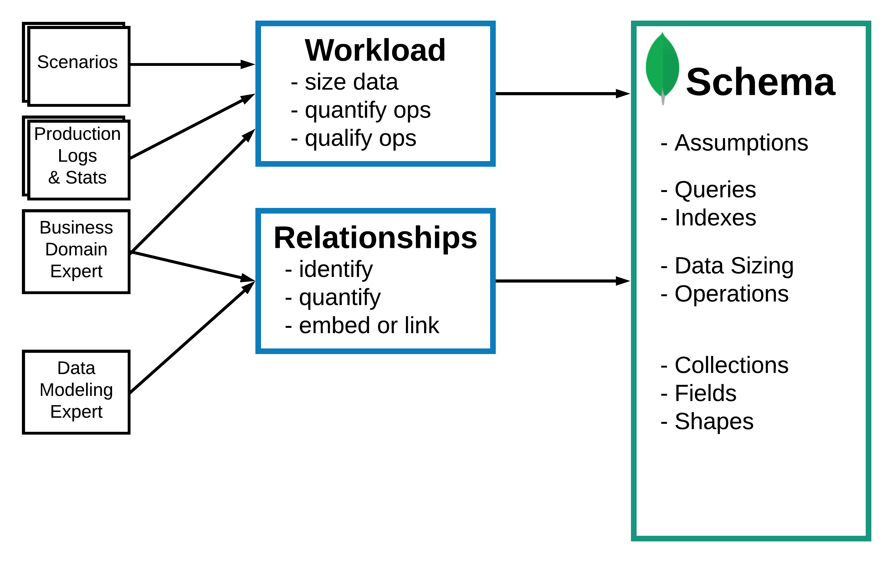

# Data modeling
{: .no_toc }

<details open markdown="block">
  <summary>
    Table of contents
  </summary>
  {: .text-delta }
1. TOC
{:toc}
</details>

Cuando empezamos el desarrollo de una aplicación nueva, generalmente queremos comenzar por diseñar el modelo de datos que vamos a usar.

{: .concept}
El modelo de datos es la representación de cómo se estructura la información en una base de datos. Define cómo se almacenan los datos y cómo se relacionan entre sí. Es una parte fundamental del diseño de una aplicación y es importante que se planifique cuidadosamente para asegurarse de que la base de datos pueda manejar los requerimientos de la aplicación y la escala en el futuro.

Como hablamos anteriormente, en una base de datos no relacional este paso es mas flexible y ágil que en una RDBMS

{: .concept}
RDBMS significa "Relational Database Management System" o Sistema de Gestión de Bases de Datos Relacionales.

## Recursos:

- [Schema Design](https://www.youtube.com/watch?v=QAqK-R9HUhc&ab_channel=MongoDB)
- [Intro a modelado de datos en MongoDB](https://www.youtube.com/watch?v=3GHZd0zv170&ab_channel=MongoDB)
- [Metodología para modelado de datos con MongoDB](https://www.youtube.com/watch?v=DUCvYbcgGsQ&t=604s&ab_channel=MongoDB)
- [Patrones avanzados](https://www.youtube.com/watch?v=bxw1AkH2aM4&ab_channel=MongoDB)

Sin más preámbulos, vamos a empezar a trabajar en un proyecto para aprender los conceptos de modelado de datos.

# El recetario de jugos

Vamos a construir una aplicación que nos permita gestionar recetas de jugos.

Lo primero que hacemos siempre es listar las características que tendría nuestra aplicación, y cual es la propuesta de valor.

Para hacer esto existen muchas metodologías en las que novamos a entrar en este tutorial, asi que simplemente vamos a listar algunas cosas que se nos vayan ocurriendo:

- Queremos los usuarios puedan registrar recetas propias.
- El usuario debe poder acceder a una lista de todas las recetas disponibles para explorar.
- Cada usuario solo puede ver sus recetas, y las recetas que otros usuarios hagan publicas.
- Un usuario solo puede editar sus propias recetas, y puede cambiar cualquier cosa.
- El usuario quiere buscar entre las recetas que jugos puede hacer con los ingredientes que tiene disponibles.

De esta lista, vamos a seleccionar las funcionalidades principales. Cuales son las cosas que le van a dar el valor principal a la aplicación. O en otras palabras, que funcionalidades van a hacer que los usuarios descarguen la app:

- Registro y gestión de usuarios.
- Registro de recetas por usuario.
- Búsqueda de recetas por ingredientes.

{: .important}
Si hacemos muy bien estas tres funcionalidades, vamos a empezar a tener usuarios!

# Metodología para diseñar el modelo

Siempre es conveniente trabajar dentro de un framework para hacer este tipo de trabajo, y por suerte existen muchas metodologías distintas y muchos recursos sobre cada una.

En este tutorial vamos a usar la metodología recomendada por MongoDB, de la cual se puede aprender mas en los recursos listados mas arriba.

Antes de empezar, algunas diferencias entre el modelado en RDBMS y NoSQL:

|  | RDBMS | MongoDB |
| --- | --- | --- |
| Pasos para modelar | 1- Definir esquema 2- Desarrollar app y queries | 1- Identificar queries 2- Definir esquema |
| Esquema inicial | - 3rd normal form - Una solución única | - Muchas soluciones |
| Evolución del esquema | - Difícil - Downtime | - Fácil - Sin downtime |

La metodología que plantea MongoDB luce asi:



## Descripción del funcionamiento de la aplicación

Es importante tener una idea de como tiene funcionar la aplicación y cuales serán los requerimientos. Esta etapa no solo implica listar funcionalidades, sino también conocimiento en el dominio del negocio. Cuantos usuarios, cuantos datos, que nivel de uso, etc.


En el caso de nuestra APP, podríamos decir lo siguiente:

- 100k users el primer año.
- 100% de crecimiento anual en cantidad de usuarios. → 400k al tercer año.
- 10 recetas per user en promedio.
- 4 búsquedas de recetas al dia por usuario.
- 5 ratings mes.

A continuación, en base a este comportamiento describimos las operaciones que serán necesarias de la siguiente manera.

| Query | Tipo | Cantidad | Requisitos |
| --- | --- | --- | --- |
| Nuevo Usuario | write | 0.1/min (<1s) | critical write. Write concern: majority. |
| Calificar receta | wite | 0.2/s (<1ms) | critical write. Write concern: 1. |
| Recetas por ingredientes y cantidades | read | <1ms | critical Read. Read Concern: majority. |
| Registro de receta | write | <1s | non critical. |
| Todas mis recetas | read | <1s | non critical. |
| Recetas mas frecuentes | read | <1ms | non critical. |
| Buscar receta por nombre | read | <1s | non critical. |

{: .important}
Es importante especificar en este detalle posibles horarios pico para las operaciones, y tener un mayor nivel de detalle en operaciones criticas

## Analizar tamaños - Sizing.

Ahora que tenemos estas operaciones, podemos estimar algunos tamaños de documentos y tener una idea del tamaño que podría tener nuestra base de datos.

Esto es importante para configurar la base de datos inicialmente.

Analicemos al menos un caso:

- Podemos estimar que una receta ocupe un espacio de 800B.
- Esto significa que el tercer año, vamos a necesitar unos 1.8GB de espacio para las recetas.
- Esto es sin tener en cuenta que agreguemos imágenes o comentarios.

## Entidades y relaciones

Ahora que tenemos una idea de como se va a comportar la aplicación, vamos a definir cuales son las diferentes entidades que tenemos, y como se relacionan.

{: .concept}
Una entidad en el contexto de modelado de datos se refiere a un objeto o concepto que se quiere almacenar.

Podemos listar las siguientes entidades:

- Usuarios.
- Recetas.
- Ingredientes.
- Calificaciones.

Una vez que tenemos las entidades, podemos mapear las relaciones entre ellas.


Estas relaciones y los datos que relevamos antes nos van a ayudar a definir que datos irán embebidos y cuales vinculados en otras colecciones.

## Embedding vs Referencing

Hay dos formas de implementar estas entidades.

En primer lugar, podemos integrar todo en un par de colecciones:


En este ejemplo tenemos dos colecciones, Usuarios y Recetas. Las entidades Calificación e Ingredientes están anidadas o integradas al documento de la receta.

O, podemos separar los ingredientes en una colección separada, y referenciar:


Que decision tomar, depende mucho de nuestro proyecto, y de como vamos a trabajar ahora y en el futuro:

- Si tenemos una aplicación pequeña y un equipo pequeño, lo mas sencillo es integrar todo lo mas que podamos (el primer ejemplo).
- Para proyectos mas grandes tenemos que prestar atención a la optimización, y por lo general tenemos que usar una mezcla entre las dos técnicas.

{: .concept}
Si hay dudas sobre el tamaño del proyecto o alguna otra característica, siempre es mejor errar en favor de la simplicidad. Es mas fácil agregar complejidad que eliminarla.

| Tipo de relación | 1:1 | 1:N | N:N |
| --- | --- | --- | --- |
| Documento anidado en documento padre | Una lectura,Sin joins | Una lectura,Sin Joins | Una lectura, Sin joins,Datos duplicados |
| Documento referenciado en padre | Lecturas mas pequeñas, Muchas lecturas | Lecturas mas pequeñas,Muchas lecturas | Lecturas mas pequeñas, Muchas lecturas |

Para hacer esto también tenemos que pensar como vamos a acceder a nuestros datos. 

Una de las lecturas criticas va a ser la búsqueda de recetas por ingredientes, por lo que seria mas eficiente que integremos los ingredientes en el documento de la receta.

## Indexes

Teniendo una idea de como van a estar estructuradas las entidades, podemos pensar un poco en los indices. Este es un paso que podemos hacer en cualquier punto del desarrollo, pero por el momento estamos seguros que en la colección de recetas, vamos a necesitar un indice para los ingredientes. Esto nos va a permitir acceder con mucha eficiencia a los datos.

## Finalizar el modelo para cada colección.

Esto implica resumir todo lo que hicimos anteriormente, dando forma a los documentos y colecciones de la siguiente manera.

**Para la colección usuarios:**

```json
{
  "_id": ObjectId,
  "name": String,
}
```

Hay muchas otras cosas que podemos incluir en esta colección, pero por el momento nos basta con esto.

**Para la colección de Recetas:**

```json
{
  "_id": ObjectId,
  "user_id": ObjectId,
  "name": String,
  "ingredients": [
    {
      "name": String,
      "qty": Number,
      "unit": String
    }
  ],
  "method": String,
  "rating": [
    {
      "user": ObjectId,
      "value": Number
    }
  ]
}
```

Como identificamos las relaciones en estos esquemas?

- La relación 1:N entre usuarios y recetas se representa con el campo `"user_id` en el documento de recetas. **(Linking)**
- La relación N:N entre ingredientes y recetas, se logra integrando un array de objetos en el campo `ingredients` en el documento de recetas. **(Embed)**
- La relación N:1 entre recetas y calificaciones se expresa integrando otro array de objetos con el campo `rating`. **(Embed)**
- La relación 1:N entre usuarios y calificaciones se ve en el campo `user` dentro del objeto de ratings. **(Embed)**

De esta forma, tenemos que planificar todas las entidades necesarias.

## Patrones

Una vez que tenemos el modelo de datos, podemos empezar a aplicar patrones de diseño que nos ayuden a optimizar el funcionamiento.

{: .concept}
Un patrón de diseño es una solución general y reutilizable a un problema común que se encuentra en el diseño de software. 

Los patrones de diseño proporcionan una forma de estandarizar y comunicar soluciones a problemas comunes, lo que hace que el proceso de diseño de software sea más eficiente y efectivo. 

MongoDB ofrece varios patrones de diseño para modelar datos. Algunos de ellos son:

- Patrón de atributo
- Patrón embebido.
- Patrón de enlace extendido.
- Patrón de árbol jerárquico.
- Patrón de extensión de entidad.
- Patrón de versionado.
- Patrón de subsets

Es importante profundizar en estos patrones. En este tutorial solo vamos a ver algunos de manera superficial, pero se puede leer mas en este link: [https://www.mongodb.com/blog/post/building-with-patterns-a-summary](https://www.mongodb.com/blog/post/building-with-patterns-a-summary)

A continuación vamos a aplicar algunos patrones que nos pueden ser útiles.

### Versioning

El patrón de versionado es un patrón de diseño en el que se utiliza una colección para gestionar múltiples versiones de un esquema. Cada documento tiene un número de versión.

{: .concept}
Este patron nos permite ir cambiando y actualizando el esquema sin experimentar downtime, ya que la idea es mantener una compatibilidad de la aplicación con todas las versiones anteriores.

Este es uno de los patrones mas interesantes, y algunas veces puede ser razón suficiente para elegir una BD NoSQL.

Para aplicar este patron en nuestro esquema, solo tenemos que agregar el campo `schema` en ambas colecciones.

### Attribute pattern

{: .concept}
El patrón de atributo es un patrón de diseño en el que se almacenan los atributos de un objeto como campos en un documento.

Este patron se utiliza cuando los documentos en una colección tienen campos similares, sobre los que queremos realizar consultas o que queremos acceder juntos.

Como los campos son similares, el patron nos dice que podemos agrupar estos campos en un array dentro del documento, y de esta forma simplificamos el uso de indices y mejoramos la eficiencia de las consultas.

En nuestro esquema ya utilizamos este patron, al convertir la entidad de ingredientes en un array de objetos.

### Computed Pattern

Este patron se utiliza cuando se accede constantemente a la base de datos para obtener algún valor calculado, como promedios o totales.

En nuestro caso, la operación mas constante sera la búsqueda de recetas. Cada vez que un usuario liste recetas, se debe mostrar la calificación promedio de la receta según la calificación que le dieron los demás usuarios.

Para evitar hacer el calculo todas las veces que se hace la consulta, este patron nos dice que podemos agregar un campo calculado, llamemosle `avgRating`. 

Cada vez que escribimos una calificación, vamos a recalcular este campo. Como estas escrituras son menos frecuentes, sera mucho mas eficiente que calcularlo en la lectura.

### Subset Pattern

El patrón Subset se utiliza cuando se desea recuperar solo un subconjunto de campos de un documento. 

En lugar de recuperar todo el documento y luego desechar los campos no deseados, este patrón de diseño nos plantea separar el documento, manteniendo los campos que nos interesan y guardando los otros en otro lugar. Estos otros campos pueden consultarse con una operación separada si es necesario.

En nuestro caso no es realmente necesario, pero es un patron muy importante, y podríamos aplicarlo al documento de recetas.

Finalmente, nuestro esquema queda asi:

**Para la colección usuarios:**

```json
{
  "_id": ObjectId,
	"schema": Number,
  "name": String,
}
```

**Para la colección de Recetas:**

```json
{
  "_id": ObjectId,
	"schema": Number,
  "userId": ObjectId,
  "name": String,
  "ingredients": [
    {
      "name": String,
      "qty": Number,
      "unit": String
    }
  ],
  "method": String,
  "rating": [
    {
      "user": ObjectId,
      "value": Number
    }
  ]
	"avgRating": Number
}
```

Podemos hacer un query utilizando agregación en MongoDB para obtener todas las recetas con el nombre del usuario que corresponde a cada una. El query podría ser algo así:

# Aplicando el esquema

Ahora que tenemos el modelo de datos diseñado, podemos probar si todo funciona como esperamos.

Lo primero sera levantar la base de datos como se vio en la sección anterior

Seguidamente,  tenemos que crear una base de datos a la que podemos llamar `appRecetas`:

```powershell
test> use appRecetas
switched to db appRecetas
appRecetas>
```

Seguidamente, podemos crear la colección `users` e insertar el primer usuario:

```powershell
appRecetas> db.users.insertOne({name: 'Felix', schema:'0'})
{
  acknowledged: true,
  insertedId: ObjectId("6408e088d97060847a376bfa")
}
appRecetas>
```

Guardamos el ID que se genera, porque lo vamos a necesitar para insertar la primera receta.

Vamos a hacer esto un una colección llamada `recepies`:

```powershell
appRecetas> db.recepies.insertOne({schema:'0', userId:ObjectId("6408e088d97060847a376bfa"), name:'jugo de banana', ingredients: [{name:'banana', qty:3}], method:'batir las bananas'})
{
  acknowledged: true,
  insertedId: ObjectId("6408e1ced97060847a376bfb")
}
appRecetas>
```

Mantenemos los datos mínimos y simples, ya que esta base de datos es solo para probar el esquema. Cuando trabajemos en la aplicación vamos a formalizar el esquema.

Para trabajar con las operaciones necesarias, agreguemos algunos datos mas:

```powershell
appRecetas> db.users.insertMany([{name: 'Rosa', schema:'0'}, {name: 'Ana', schema: '0'}])
{
  acknowledged: true,
  insertedIds: {
    '0': ObjectId("6408e296d97060847a376bfc"),
    '1': ObjectId("6408e296d97060847a376bfd")
  }
}
appRecetas>
```

```powershell
appRecetas> db.recepies.insertMany([{schema:'0', userId:ObjectId("6408e296d97060847a376bfc"), name:'jugo de manzana', ingredients: [{name:'manzana', qty:3}], method:'batir todo'}, {schema:'0', userId:ObjectId("6408e296d97060847a376bfc"), name:'jugo de pera', ingredients: [{name:'pera', qty:3}], method:'batir todo'},{schema:'0', userId:ObjectId("6408e296d97060847a376bfd"), name:'jugo de mango', ingredients: [{name:'mango', qty:3}], method:'batir todo'}])
{
  acknowledged: true,
  insertedIds: {
    '0': ObjectId("6408e413d97060847a376c01"),
    '1': ObjectId("6408e413d97060847a376c02"),
    '2': ObjectId("6408e413d97060847a376c03")
  }
}
appRecetas>
```

# Operaciones de la aplicación

Con los datos que creamos arriba, podemos pasar a probar las operaciones que vamos a necesitar para nuestra app.

El registro de usuarios es un insert sencillo, por lo menos en esta etapa, asi que podemos saltear esta operación.

Para hacer estas pruebas podemos anotar en algún lado los ID para los tres usuarios que creamos, porque van a ser necesarios:

| name | -id |
| --- | --- |
| Felix | ObjectId("6408e088d97060847a376bfa") |
| Rosa | ObjectId("6408e296d97060847a376bfc") |
| Ana | ObjectId("6408e296d97060847a376bfd") |

### Calificar Receta

Cuando queramos calificar una receta, nuestra aplicación va a tener a mano el ID del usuario (porque esta logueado), asi que podemos usar este dato como insumo.

Esta es una escritura compleja, porque necesitamos hacer un par de pasos:

- Obtener la receta que queremos cambiar, para esto en la aplicación usaríamos el ID. Por ahora podemos usar el nombre.
- Agregar al array de calificaciones los datos correspondientes al user y su calificación.
- Calcular el promedio de todas las calificaciones.
- Agregar un campo calculado, con el resultado del promedio.

Hay muchas formas de hacer esto.

Si en la App tenemos todos los datos del documento de la receta, podemos calcular todo y hacer un update normal.

Pero si solo tenemos el ID del documento, podemos hacer un update con agregación.

Este tipo de updates nos permiten ejecutar varios pasos.

```powershell
db.recepies.updateOne(
	{name:'jugo de pera'}, # Esto es para obtener el documento que queremos editar.
	[ # Aca empieza lo que llamamos un pipeline, con muchos pasos
		{$set: {rating:{$concatArrays:[{$ifNull:['$rating',[]]},[{user:ObjectId("6408e088d97060847a376bfa"),value:5}]]}}}, # este paso concatena el nuevo objeto en el array
		{$set: {avgRating: {$trunc: [{$avg:['$rating.value']},0]}}} # con este paso, se calcula el promedio y se inserta en el campo correspondiente
	]
)
```

### Todas las recetas

Consultar todas las recetas se puede hacer usando el comando `find()` sobre la colección correspondiente.

### Recetas por ingredientes

Esta es otra consulta un poco compleja.

Necesitamos encontrar todas las recetas que tengan ingredientes específicos.

Imaginemos que el único ingrediente que teneos es pera.

Podemos hacer algo asi:

```powershell
{'ingredients.name': 'pera'}
```

Esto va a funcionar para este caso, pero no va a funcionar para el caso en el que tengamos mas ingredientes.

Si solo tenemos banana, por ejemplo, el único jugo que tiene este ingrediente es el jugo de banana, pero si esta receta necesita otro ingrediente (como leche) entonces no podremos hacer ningún jugo.

Para resolver esto, podemos hacer lo siguiente:

```powershell
{'[ingredients.name](http://ingredients.name/)': {$all:['banana', 'leche']}, ingredients: {$size:2}}
```

Esto busca todas las recetas que usen TODOS los ingredientes listados, Y donde el array de ingredientes tenga 2 elementos.

Para que esto funcione, tenemos que calcular la cantidad de ingredientes desde nuestra aplicación, pero esto es fácil de resolver.

Otra forma de hacer esto es con un pipeline.

### Todas las recetas de un usuario

Para traer todas las recetas que pertenecen a un usuario, tenemos que hacer un join.

También tenemos que hacer un join si queremos listar todas las recetas con el nombre del usuario que las creo:

```json
[
  {
    $match:
      {},
  },
  {
    $lookup:
      {
        from: "users",
        localField: "userId",
        foreignField: "_id",
        as: "users",
      },
  },
  {
    $unwind:
      {
        path: "$users",
        preserveNullAndEmptyArrays: true,
      },
  },
  {
    $project:
      {
        racetasName: "$name",
        userName: "$users.name",
      },
  },
]
```

En el pipeline anterior, solo estamos trayendo los nombres de la receta y del usuario, para la aplicación traeríamos todos.

{: .important}
Corremos este pipeline con el comando `db.recepies.aggregate()`


Para obtener todas las recetas de un solo usuario, es mas simple, solo buscamos por el id del usuario:

```powershell
appRecetas> db.recepies.find({userId: ObjectId("6408e296d97060847a376bfc")})
[
  {
    _id: ObjectId("6408e413d97060847a376c01"),
    schema: '0',
    userId: ObjectId("6408e296d97060847a376bfc"),
    name: 'jugo de manzana',
    ingredients: [ { name: 'manzana', qty: 3 } ],
    method: 'batir todo'
  },
  {
    _id: ObjectId("6408e413d97060847a376c02"),
    schema: '0',
    userId: ObjectId("6408e296d97060847a376bfc"),
    name: 'jugo de pera',
    ingredients: [ { name: 'pera', qty: 3 } ],
    method: 'batir todo',
    rating: [
      { user: ObjectId("6408e088d97060847a376bfa"), value: 5 },
      { user: ObjectId("6408e088d97060847a376bfa"), value: 1 }
    ],
    avgRating: 3
  }
]
appRecetas>
```